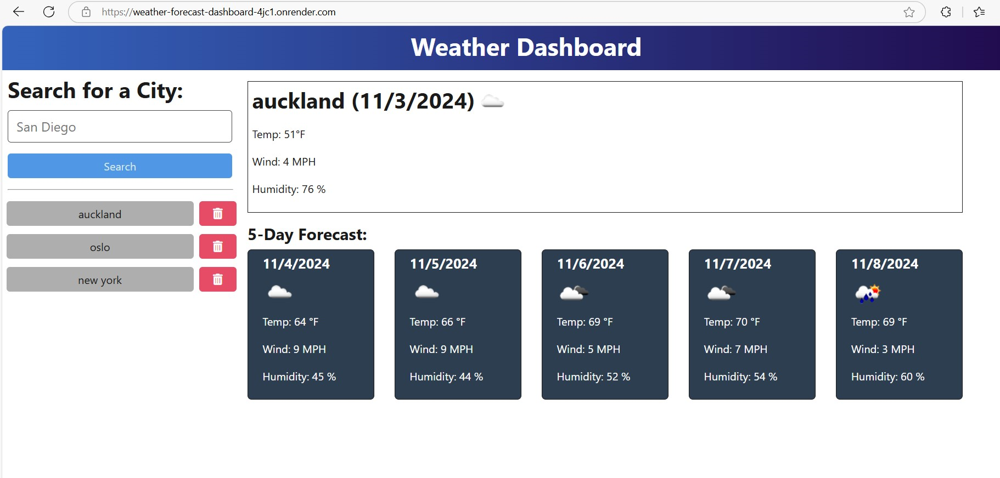

# Weather Dashboard

A dynamic weather dashboard application that allows travelers to view current and future weather conditions for multiple cities to help plan their trips effectively.

## Description

This Weather Dashboard application uses the OpenWeather API to retrieve weather data for cities worldwide. Built with TypeScript, Express.js, and Vite, it features:

- Current weather conditions
- 5-day weather forecast
- Search history functionality
- Dynamic weather icons
- Responsive design
- Temperature in Fahrenheit
- Wind speed and humidity data



## Table of Contents

- [Installation](#installation)
- [Usage](#usage)
- [Features](#features)
- [Technology Stack](#technology-stack)
- [API Reference](#api-reference)
- [Environment Variables](#environment-variables)
- [Contributing](#contributing)
- [License](#license)

## Installation

1. Clone the repository:
```bash
git clone https://github.com/yourusername/Weather-Forecast-Dashboard.git

2. Install dependencies for both client and server:

npm install

3. Create a .env file in the server directory:

cd server
touch .env

4. Add your OpenWeather API key to the .env file:

API_BASE_URL=https://api.openweathermap.org
API_KEY=your_api_key_here

5. Build and start the application:

npm run start

Usage

Open your web browser and navigate to http://localhost:3001
Enter a city name in the search box
View current weather and 5-day forecast
Click on cities in the search history to view their weather again
Delete cities from search history using the trash icon

Features

Current Weather Display:

City name and date
Weather condition icon
Temperature
Wind speed
Humidity


5-Day Forecast:

Date
Weather condition icon
Temperature
Wind speed
Humidity


Search History:

Persistent storage of searched cities
Quick access to previous searches
Ability to delete cities from history


Technology Stack

Frontend:

TypeScript
HTML5
CSS3
Vite
Day.js for date formatting


Backend:

Node.js
Express.js
TypeScript
dotenv for environment variables


APIs:

OpenWeather API
Geocoding API

API Reference
The application uses the following OpenWeather APIs:

5 Day Weather Forecast API
Geocoding API

For more information, visit OpenWeather API Documentation
Environment Variables
Required environment variables in the server's .env file:
envCopyAPI_BASE_URL=https://api.openweathermap.org
API_KEY=your_openweather_api_key
Project Structure
CopyWeather-Forecast-Dashboard/
├── client/                 # Frontend application
│   ├── src/               # Source files
│   ├── public/            # Public assets
│   └── package.json       # Frontend dependencies
├── server/                # Backend application
│   ├── src/              # Source files
│   ├── db/               # Database files
│   └── package.json      # Backend dependencies
└── package.json          # Root package.json
Contributing

Fork the repository
Create your feature branch (git checkout -b feature/AmazingFeature)
Commit your changes (git commit -m 'Add some AmazingFeature')
Push to the branch (git push origin feature/AmazingFeature)
Open a Pull Request

License
This project is licensed under the MIT License - see the LICENSE.md file for details
Acknowledgments

OpenWeather API for weather data
Font Awesome for icons
The educational team for the project requirements and guidance

Contact
Dov Goldenthal - dgoldenthal@gmail.com
Project Link: https://github.com/dgoldenthal/Weather-Forecast-Dashboard
